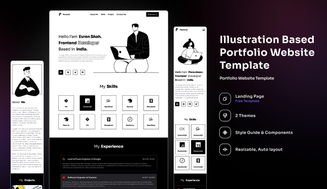

Portfolio Website Template

# Portfolio Website Template

Welcome to this **Next.js** portfolio template! This is a customizable and easy-to-use template for showcasing your skills, experience, and projects. Follow the instructions below to get started and make it your own.

---

## 🚀 Getting Started

### 1\. Clone the Repository

    git clone https://github.com/your-repository-name.git

### 2\. Install Dependencies

Navigate to the project directory and install the required packages:

    cd your-repository-name
    npm install
    # Or
    yarn install

### 3\. Run the Development Server

Start the development server to view your portfolio locally:

    npm run dev
    # Or
    yarn dev

Open [http://localhost:3000](http://localhost:3000) in your browser to view your website.

---

## 🛠️ Available Config Files

This template uses configuration files for easy customization. You can modify the following sections by updating the respective config files:

- **heroConfig.ts**: Customize your hero section, including your name, role, and personal description.
- **aboutConfig.ts**: Edit the about me section with your personalized introduction and career highlights.
- **experienceConfig.ts**: Update your work experience section, including company logos, roles, and descriptions.
- **projectsConfig.ts**: Modify the list of projects you want to showcase, including images, descriptions, and links.
- **skillsConfig.ts**: Add or remove skills along with the corresponding icons to represent your expertise.

---

## Metadata Update

To ensure that your website displays your own name and other personalized information, update the metadata in the `app/layout.tsx` file:

    `<Head>`
      `<title>`Your Name's Portfolio `</title>`
      `<meta name="description" content="Your personal portfolio showcasing your projects and experience." />`
      `<meta property="og:title" content="Your Name's Portfolio" />`
      `<meta property="og:description" content="Your personal portfolio showcasing your projects and experience." />`
      `<meta property="og:image" content="/path-to-your-image.jpg" />`
      `<meta property="og:url" content="https://your-portfolio.com" />`
    `</Head>`

---

## 📢 Credits

• Illustration-Based Portfolio Website Template by **Jhanvi Shah**
